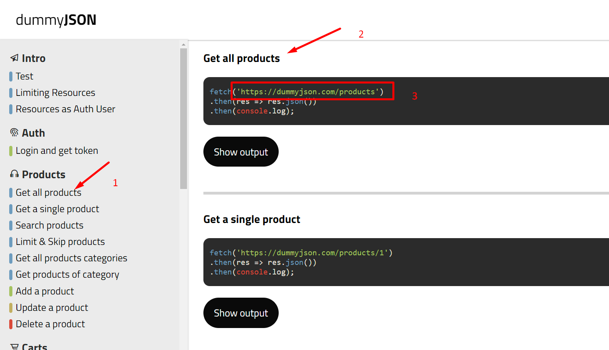
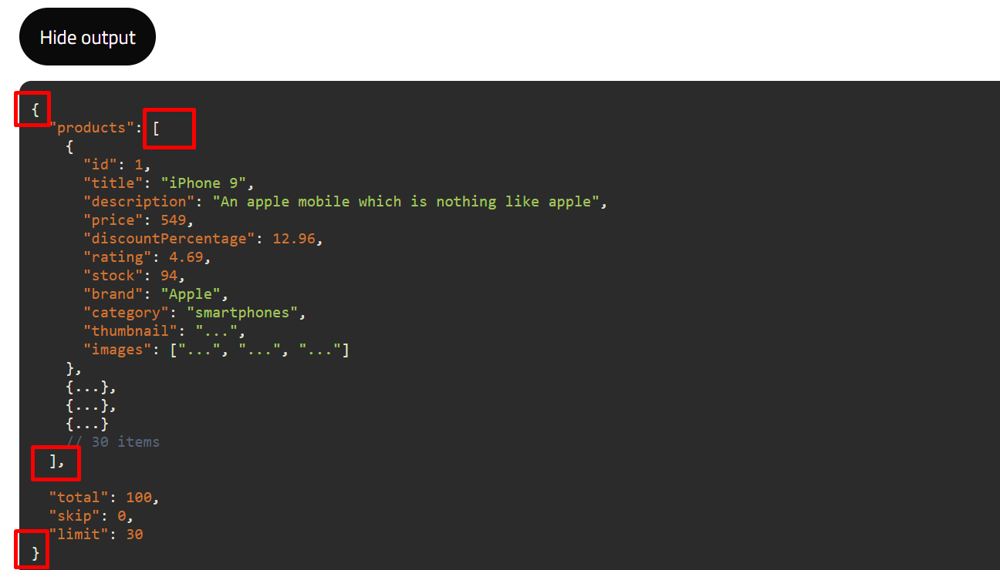

# praktika

Naudosite nemokama api is https://dummyjson.com/docs

1. susikurti nauja projekta, prisideti routeri
2. sukurti puslapiu komponentus Products, Users, Posts, Todos
3. kiekviename puslapuje kurti to resurso saraso komponenta. pvz Products psl bus ProductsList, Users psl UsersList ir t.t.
4. kiekvienas saraso komponentas generuota Vieneto komponeta (SingleProduct, SingleUser ir t.t.)
5. sarasu "List" komponentuose

   5.1. parisiunciam duomenis ir irasom i state. (ProductsList,UsersList ir t.t. )

   5.2. generuojam Vieneto "Single" komponentus su ju informacija (SingleProduct, SingleUser ir t.t.)

6. Vieneto "Single" komponentuose pridedam mygtuka delete

   6.1 delete funkcija aprasom "List" komponentuose (ProductsList,UsersList ir t.t. ) ir vygdom fetch ar axios delete veiksma.

   6.2 sekemes atveju istrinam objekta lokaliai kad matytume pokyti sveteineje.

## kievienas resursas turi dokumentacija

paspauskite ant "show output" kad matyti kokiu formatu grys atsakymas
taip pat pasikonsolinkite ka gavote pagal tai spreskite ka irasyti i state

