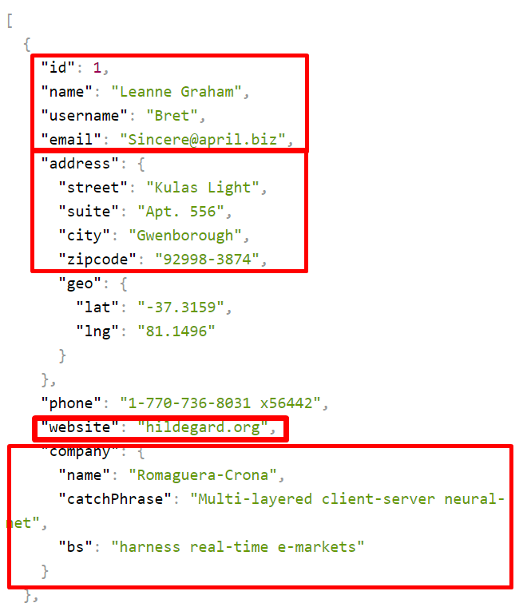

# praktika

## CartoosList

1. Atvaizduoti duomenis komponente
2. atvaizduoti list ir single atskiruose komponentuose
3. mygtuko paspaudimu isrikiuoti pagal metus

```js
const cartoons = [
  {
    id: 1,
    title: 'SpongeBob SquarePants',
    year: 1999,
    director: 'Stephen Hillenburg',
    wasExpensive: false,
  },
  {
    id: 2,
    title: 'Looney Tunes',
    year: 1930,
    director: 'Various',
    wasExpensive: false,
  },
  {
    id: 3,
    title: 'Avatar: The Last Airbender',
    year: 2005,
    director: 'Michael Dante DiMartino, Bryan Konietzko',
    wasExpensive: true,
  },
  {
    id: 4,
    title: 'Scooby-Doo, Where Are You!',
    year: 1969,
    director: 'Joe Ruby, Ken Spears',
    wasExpensive: false,
  },
  {
    id: 5,
    title: 'Tom and Jerry',
    year: 1940,
    director: 'William Hanna, Joseph Barbera',
    wasExpensive: false,
  },
];
```

## API users

ApiUsers.jsx komponente parsiusti ir atvaizduoti vartotojus is
https://jsonplaceholder.typicode.com/users

1. susikurti vartotojams state pradine reiksme tuscias masyvas.
2. tik uzsikrovus komponentui parsiusti duomenis (useEffect) ir issaugoti state
3. sukti cikla ir generuoti vartotoju korteles. Korteles atvaizduoti sia info
   

4. adresa atvaizduoti atskiru komponentu kuris gauna info per props
5. kompanija atvaizduoti atskiru komponentu kuris gauna info per props
6. graziai stilizuojam su css
